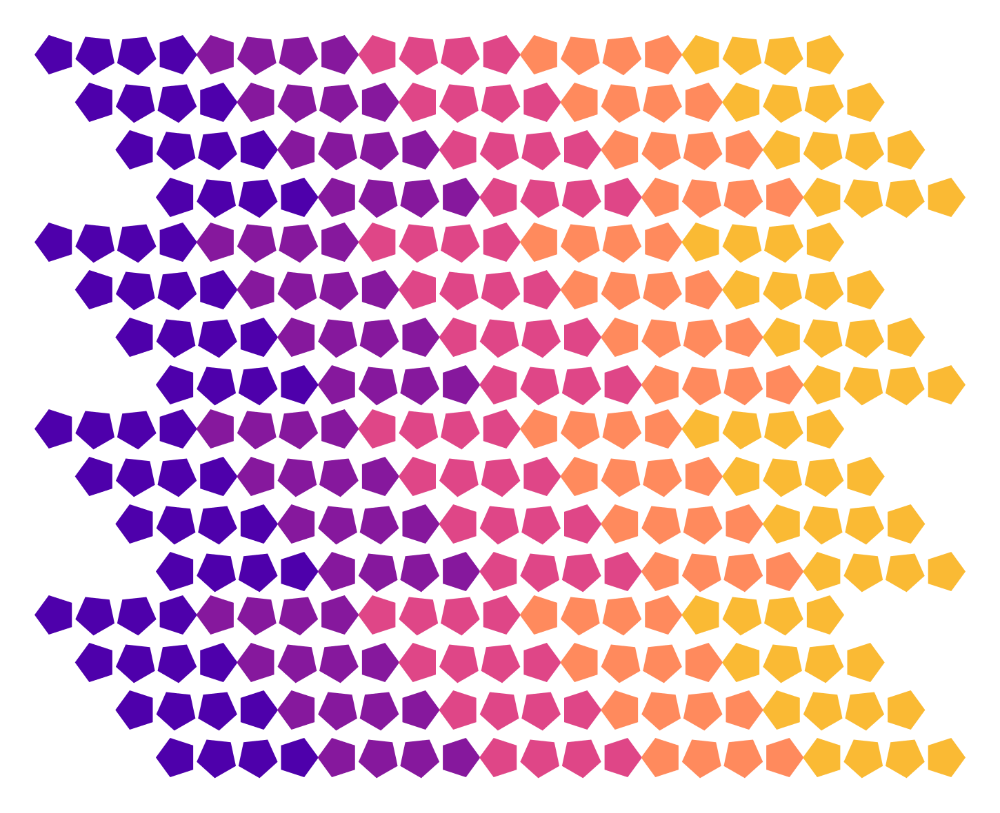

#Padrão geométrico com primitivas básicas e nó grid

O exercício que realizei foi o seguinte:

<h3>Criar padrão geométrico explorando as primitivas básicas e o nó grid.</h3>

Meu resultado final foi:

Para isso,

Antes de tudo, o passo 0: 

- 0: fui, na janela do software, em FILE e em DOCUMENTS PROPERTIES e criei um canva de (with)1350x1080(height)

Então, começando a programação visual:

- 1: criei 6 polígonos. POLYGON (radius 30, sides 5)
- 2: criei 6 cores RGB (uma delas, branca) 
- 3: criei o node COLORIZE para cada polígono
- 4: coloquei o _output_ do polígono no campo _shape_ do COLORIZE
- 5: para cada node COLORIZE, linkei um _output_ de um RGB em seu campo _fill (color)_
- 6: para cada POLYGON, criei um node ROTATE, ou seja, criei 6. 
- 7: Coloquei o _output_ do POLYGON no _shape (geometry) do ROTATE
- 8: como minha intenção foi de sequenciar os ângulos, criei um node SAMPLE para definir o intervalo angular. Como quis que a variação ocorresse 4 vezes, o intervalo angular iniciou em 180, passou por 225, 270 e terminou em 360 graus. A seleçãon no node foi (4 amounts, start 180 e end 360). 
- 9: linkei o _output_ de SAMPLE no campo _angle_ de cada node ROTATE

Então, criei um GRID de 1290x207, com 23 colunas e 4 linhas (minha composição será uma grade de 23x16). Para isso:

- 10: criei um node COMBINE, colocando em cada campo de entrada _listx (list)_, um _output_ de COLORIZE diferente (6 no total, sendo a última cor vinculada ao COMBINE, a cor branca, para dar o efeito de ZIGZAG nas laterais da imagem)
- 11: criei um node GRID (23 columns, 4 rows, with 1290, height 207)
- 12: criei um node TRANSLATE
- 13: no campo _shape (geometry)_ coloquei um _output_ do COMBINE
- 14: no campo _translate (point)_ coloquei um _output_ do GRID

Com essa base pronta, meu trabalho agora foi criar vários GRIDS com a largura total e com 1/4 da altura. 
Por quê? Porque meu objetivo é de criar uma composição com forma de raio. 

Caso não fosse, se fosse apenas uma composição com formatação linear (horizontal, vertical ou diagonal), bastaria brincar com um único GRID, testando o número de colunas e linhas (columns, rows).

Agora, 

- 12: copiei os nodes dos passos 10 a 14 mais 3 vezes. 

Com isso, o último passo foi editar a altura de cada GRID

- 13: clicando em cada um dos 4 nodes GRID, alterei o seguno campo de (position) para a altura desejada, considerando que gostariade um GRID acima do outro, em um intervalo de 207 em 207.

prontinho :)

Obs: provavelmente isso pode ser feito muuuito mais rápido e facilmente. Porém, essa foi minha primeira incursão no Nodebox, por isso, estou mais do que satisfeita. 

