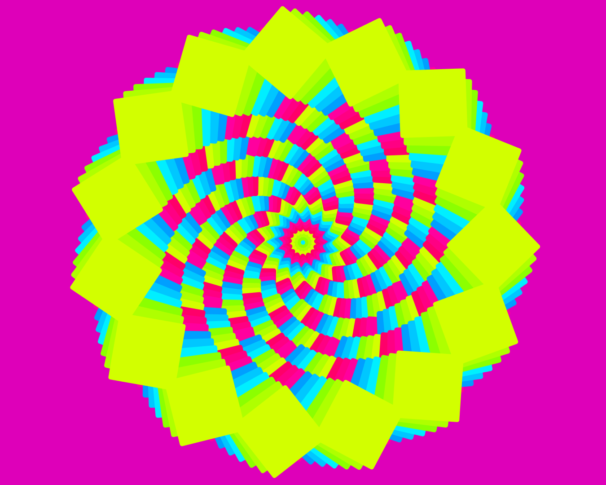

# Composição com transformações e nó copy

O exercício que realizei foi o seguinte:

<h3>Criar uma composição livre utilizando as transformações e o nó copy.</h3>

Meu resultado final foi:

Para isso,

Antes de tudo, o passo 0: 

- 0: fui, na janela do software, em FILE e em DOCUMENTS PROPERTIES e criei um canva de (with)1350x1080(height)

Então, começando a programação visual:

- 1: criei 1 retângulo RECT (width e height 150.00, roundness 5x5)
- 2: para variar o tamanho dos retângulos, criei um node SAMPLE para definir o intervalo, numa quantidade de 60 (amount), começando em 20 e terminando em 300
- 3: conectei o _output_ do SAMPLE no campo _position (point)_ do RECT
- 4: criei o node ROTATE
- 5: para variar o ângulo dos retângulos, criei um node SAMPLE para definir o intervalo angular, numa quantidade de 15 (amount), começando em 70 e terminando em 700 graus
- 6: conectei o _output_ do RECT no campo _shape (geometry)_ do ROTATE
- 7: criei o node COLORIZE

Nesse projeto, quis alterar as cores de forma diferente. 

- 8: primeiro criei um node SAMPLE com (amount) de 3, intervalo de 80 a 120. 
- 9: depois, criei 3 nodes RGB
- 10: conectei o _output_ do SAMPLE no campo _red (float)_ de um RGB, conectei o mesmo _output_ no campo _green float_ de outro node RGB e repeti o passo conectando o _output_ no terceiro campo _blue (float)_ do último node RGB
- 11: o próximo passo foi configurar cada node RGB com as cores que eu queria alcançar. Esse passo foi intuitivo e na base da tentativa e erro. Eu estava buscando as cores CMY (ciano, magenta e amarelo), por isso fui testando até encontrá-las

Lembre-se que ciano não possui vermelho, magenta não possui verde e amarelo não possui azul. Após encontrar as três cores desejadas:

- 12: eu criei um node COMBINE, colocando o _output_ de cada node RGB em um dos campos _listx (list) do node COMBINE

Agora vamos voltar ao node COLORIZE, criado no passo 7.

- 13: conectei o _output_ do COMBINE ao campo _fill (color)_ do node COLORIZE
- 14: criei o node COPY. Esse node, diferentemente do node GRId, cria cópias dos nodes SHAPE alterando sua posição e disposição no canvas.
- 15: conectei o _output_ do COLORIZE ao campo _shape (geometry)_ do node COPY
- 16: configurei o node COPY também na base da tentativa e erro, criando a imagem de flor

Por fim, coloquei um fundo na imagem, antes de salvá-la. Para isso,
- 17: criei um node RECT do exato tamanho do canvas
- 18: pintei com a cor que quis (usando o node COLORIZE)
- 19: criei um node COMBINE e combinei os nodes COPY e COLORIZE do RECT, deixando o node COPY para a frente;

Ufa! 

