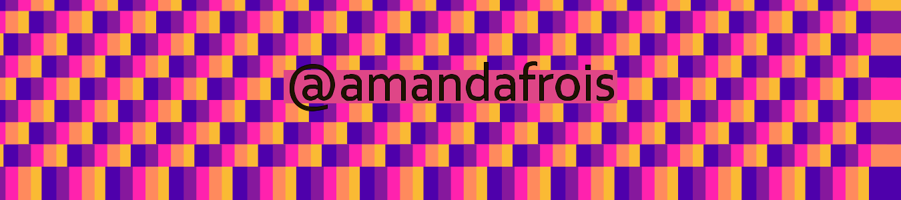

# Desenhando com código :stuck_out_tongue_winking_eye:

Este repositório apresenta meus primeiros passos em programação visual, utilizando o sotware Nodebox 3.0.

:art: Estou aprendendo a programar na oficina intensiva **Desenhando com Código**, ministrada pelo designer e artista gráfico [Guilherme Vieira](https://github.com/guilhermesv), no [Grafatório de Londrina](https://grafatorio.com/site/) em Setembro de 2020.

A idéia é reproduzir e criar composições, estáticas e animadas, no software.

:computer: Mais infos sobre a oficina no [site](https://guilhermesv.github.io/DesenhandoComCodigo-Grafatorio/) do Guilherme. 

 [Amanda Frois](https://amandafrois.com.br) :wink::star2: